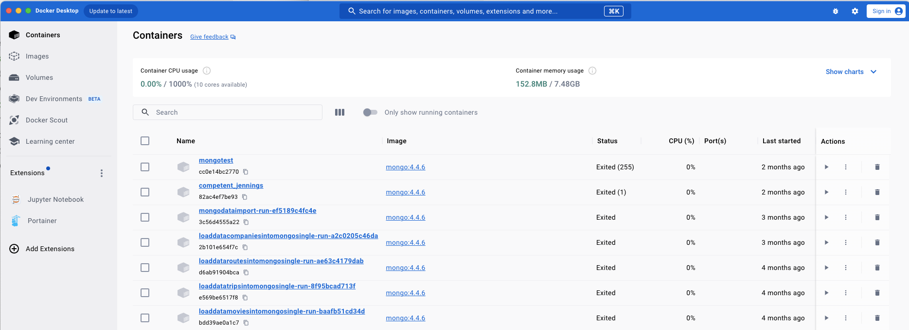
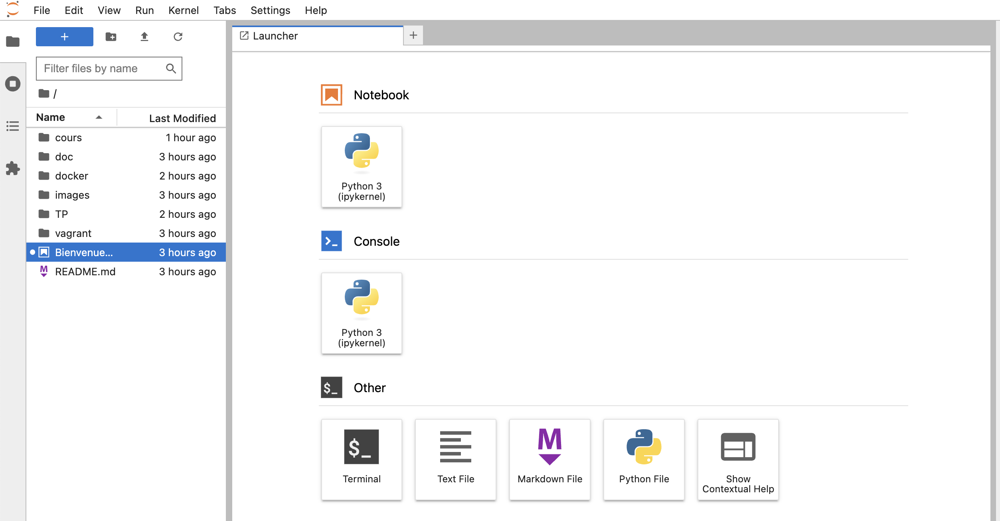

# PREPARATION DE VOTRE ENVIRONNEMENT POUR LE MODULE NOSQL

---

## OBJECTIFS PEDAGOGIQUES

Avec l’explosion des volumes de données générés par les utilisateurs, les entreprises, les objets connectés et les applications cloud, le stockage est devenu une brique critique de toute infrastructure informatique.

Qu’il s’agisse de fichiers partagés, de machines virtuelles, de bases de données, ou encore de contenus multimédias, chaque usage nécessite un modèle de stockage adapté, capable de garantir :
	•	performance,
	•	fiabilité,
	•	sécurité,
	•	évolutivité.

Dans ce module, nous découvrirons les trois grands types de stockage de données — bloc, fichier et objet — en analysant leurs atouts et inconvénients.

Ces systèmes permettent de conserver les données de manière fiable, mais ne facilitent pas toujours leur structuration logique ni leur exploration.

C’est là que les bases de données entrent en jeu : elles offrent une couche d’abstraction qui permet de modéliser les relations entre les objets ou entités, de les interroger efficacement et de valoriser leur contenu.

Nous verrons également comment ces bases de données ont évolué au fil du temps du modèle relationnel traditionnel (SQL), vers les bases NoSQL, plus flexibles et scalables, jusqu’aux bases vectorielles, conçues pour manipuler des données complexes, notamment dans le contexte de l’intelligence artificielle.


# Préparer son environnement de Travail

Les travaux pratiques du module s'appuieront sur un environnement conteneurisé sous Docker.
Toutes les applications que nous utiliserons feront parties du catalogue Docker Hub et nous détaillerons dans la suite de ce README les étapes à suivre :

* 1 - Prérequis matériel    
* 2 - Installer Docker Desktop
* 3 - Télécharger les images docker
* 4 - Installation de NoSQLBOOSTER

La création d'un compte Docker Hub est fortement recommandé pour les accès aux images :

https://app.docker.com/signup


## 1 - Prérequis

 Même si la conteneurisation à l'avantage d'être légère, les prérequis matériels pour suivre ce module sont les suivants :
* > 4Go de RAM
* > 4 cores
* > 5 Go d'espace disque libre

En termes de privilèges, vous devrez disposer des droits d'administrateur sur votre machine.
Vous devrez disposer d'un client git ou d'un IDE disposant des fonctionnalités git.


## 2 - Installation de Docker desktop

Docker fournit un logiciel Docker Desktop pour déployer très facilement et rapidement des applications par le biais d'images docker.
Vous pourrez télécharger Docker Desktop à l’url suivante :

https://www.docker.com/products/docker-desktop

---
**NOTE**

Selon la version de votre Windows, il peut vous être demandé d'installer WSL 2.
---

Le tableau de bord ci-dessous s’affichera :

---
**WARNING**

Si c'est la première fois que vous installez Docker Desktop le tableau des containers sera vide mais ne vous inquiétez pas c'est que temporaire.

---




Pour travailler avec docker on pourrait utiliser l'interface graphique fournie par Docker Desktop mais pour des raisons de facilité et de cohérence d'environnement il est fortement recommandé d'utiliser les invites de commande.

Ouvrez un terminal ou un powershell si vous êtes sous Windows

---
**WARNING**

Si vous êtes sur Windows, ne confondez pas MSDOS et Powershell.

---

---
**WARNING**

Pour ceux qui sont sous Linux, il est probable que le plugin compose ne soit pas installé en même temps que docker desktop.
Pour vérifier que le plugin compose est bien installé avec docker, exécutez dans un terminal la commande suivante :
`docker compose --help`

Si vous n'obtenez pas l'aide de `docker compose` alors vous devrez installer le plugin.
Le guide d'installation est par ici : https://docs.docker.com/compose/install/linux/

---

## 3 - Télécharger les images docker

Dans le répertoire de votre choix `$monrepertoire`, cloner le répertoire gitlab suivant :

```
cd $monrepertoire
git clone https://github.com/oaidel38090/envol
```

Positionner vous à présent dans le répertoire `envol/docker` puis télécharger l'ensemble des images docker nécessaire à la formation avec la commande suivante :

```
cd $monrepertoire/envol/docker
docker compose pull
```

L'ensemble des cours et TP est disponible dans le répertoire gitlab.

Pour vérifier que votre environnement est opérationnel lancer la commande suivante :

```
cd $monrepertoire/envol/docker
docker compose up -d jupyterlab
```

Cette commande va lancer l'application jupyterlab sur votre ordinateur et sera accessible à l'url [http://127.0.0.1:8888/lab](http://127.0.0.1:8888/lab).
La page suivante devrait apparaitre :




Pour arrêter l'application jupyterlab, il vous suffit d'exécuter la commande suivante :

```
docker stop jupyterlab
```

4 - Installation de NoSQLBOOSTER

NosqlBooster est un client graphique gratuit pour faciliter les opérations sur MongoDB. Il est téléchargeable à lʼurl suivante :

https://www.nosqlbooster.com/downloads

Télécharger le et installer le sur votre ordinateur.


Bravo, vous êtes à présent prêt à suivre le module.
